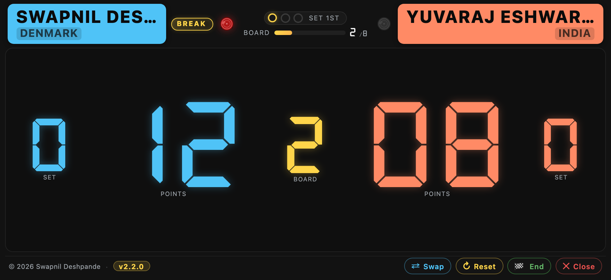
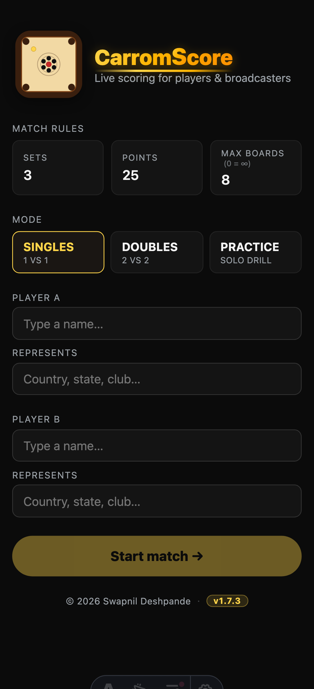
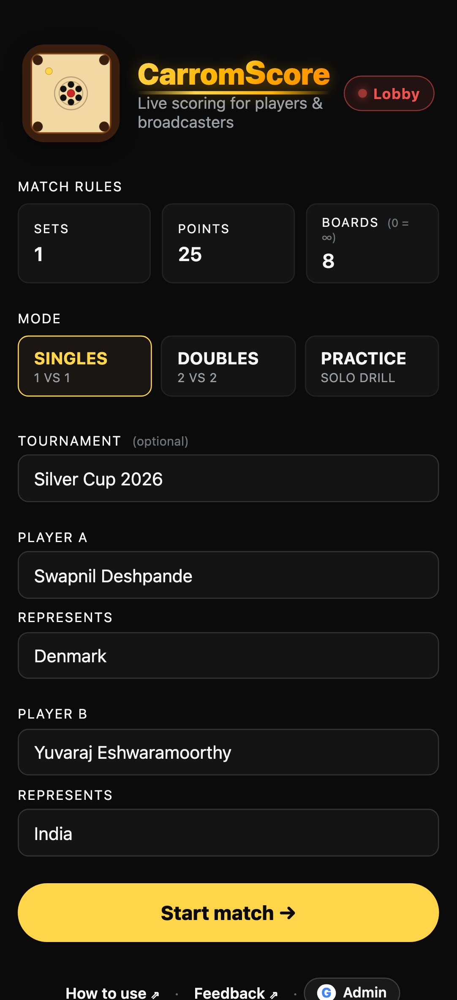
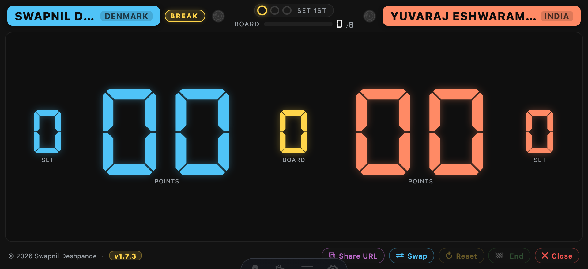
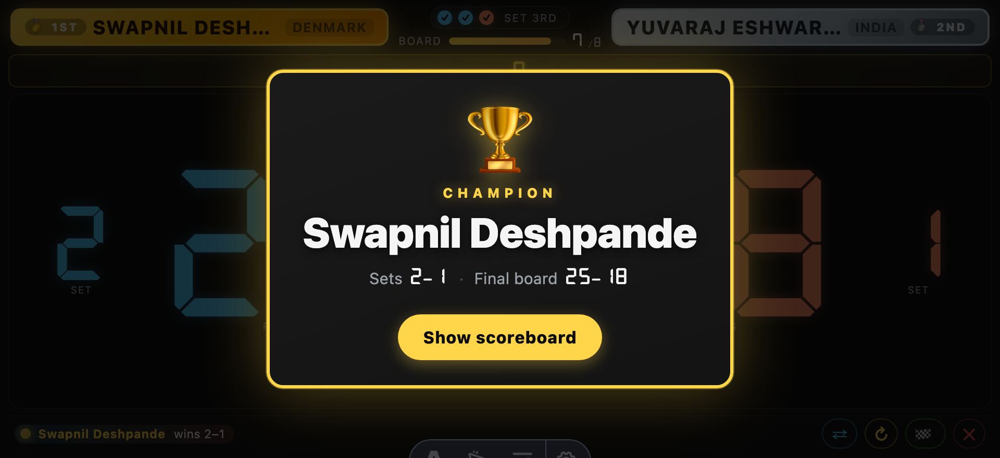
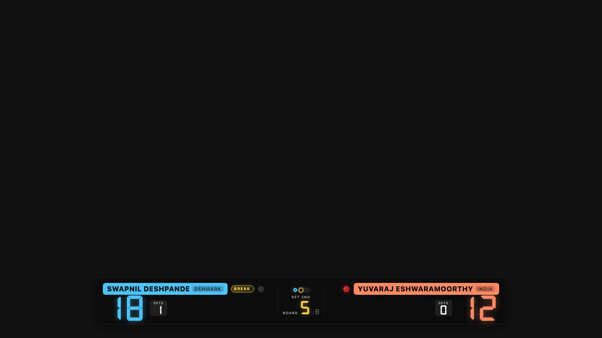
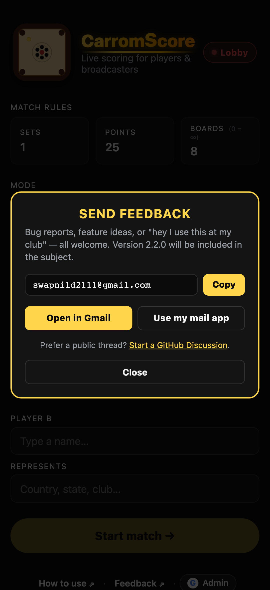

<h1 align="center">CarromScore</h1>

  
  
  
  
  
  
  

  
  
  
  
  

**A free live scoreboard for carrom matches** — for players at the
board, for organisers running club nights and tournaments, and for
anyone streaming to YouTube or Facebook.

Runs on your phone, tablet, laptop, or projector. **Works offline** —
no internet? Score anyway; syncs when you're back online. Casual
scoring stays anonymous — no accounts required. Sign in only if you
want to edit your own matches or run a tournament as an organiser.
Same code on every device.

  

## Try it now

- 🌐 **Any device with a browser** → open **https://swapnild2111.github.io/carromscore/**
- 📱 **Android** → [Install guide](./docs/features/install-android.md)
- 🍎 **iPhone / iPad** → [Install guide](./docs/features/install-iphone.md)

That's it. No account. No download from an app store.

## What it does

**Score any carrom match.** Singles, doubles, or a solo drill.

- 🎯 **[Keeping the score](./docs/features/keeping-the-score.md)** —
  **tap** (or swipe left) on a digit to add a point; **swipe right**
  on a digit to reduce — that's how you undo a mistake or roll back a
  wrong-side credit. Same gesture works on POINTS, SET, and BOARD.
  Big high-contrast numbers for camera legibility. BOARD starts at 0
  and advances only when you tap; queen marker guards BOARD +1 so no
  board goes past half-scored.
- 🎱 **[Break and queen indicators](./docs/features/break-and-queen.md)** —
  a small chip shows who's breaking; a coloured queen coin shows who
  pocketed it. Never lose track mid-match.
- 🏓 **[Practice mode](./docs/features/practice-mode.md)** — solo drill
  format. Track missed shots per board, get a full recap at the end.
  Lower total = better session. Broadcasts to Live like versus matches.
- 🌐 **[Offline-first](./docs/features/offline-mode.md)** — no internet?
  Score anyway. Start a match, play all boards, End it. Queued locally
  on your device; syncs to the shared server the moment the network
  returns. Amber banner + grey lobby chip make the state obvious at a
  glance. Works on trains, in dead-WiFi halls, on patchy data.
- 🏷️ **Tournament tag** — tag a match with an event name and every
  match sharing that tag groups together in the lobby. Auto-suggests
  from your prior tags. Tagged versus matches keep for a year;
  untagged matches and practice runs keep for 3 months. Organisers
  can flip a tournament to **Closed** to warn umpires that new
  matches shouldn't be added (advisory — the warning can still be
  overridden if a bracket reopens).
- 🎯 **Tournament rounds** — a tournament can carry a list of named
  stages (Round of 16, Quarter-finals, Semi-finals, Final, ...).
  Umpires pick a round at match setup; the lobby's History tab
  groups two levels deep (tournament → round) and Reports gets a
  per-round breakdown alongside the combined view.
- 📡 **Live broadcast + spectator URL** — toggle "Live" on setup and
  every state change publishes to a shareable URL. Friends and family
  open the URL on any phone; the score updates within a second of
  every tap.
- 📺 **[Broadcast overlay](./docs/features/broadcast-overlay.md)** —
  point OBS or Prism at a URL and get a transparent scoreboard strip
  live-composited over your camera feed.
- 📜 **Lobby** — one place to browse ongoing broadcasts, every match
  you've ever finished, and per-tournament reports. Three tabs:
  Now Playing / History / Reports. Grouped by tournament tag,
  collapsible; Practice runs get their own section in History.
- 📊 **Reports** — pick a tournament from the chip picker and see
  per-player wins/losses/draws, cumulative boards + points, plus two
  bar charts and a copy-pasteable match table. ⧉ Copy or ↓ Download
  CSV for use in any spreadsheet.
- 🤝 **Draw match + deciding board** — if the last board of a match
  ends with sets AND points level, End opens a chooser: play one
  deciding board to break the tie, or commit as a draw. Different
  regions decide ties differently; the umpire picks.
- 🛠️ **Admin panel for organisers and super-admins** — signed-in
  organisers get their own `/admin/` surface with Players,
  Tournaments, Live matches, and History cleanup — full control over
  the events they organise, no super-admin needed for routine work.
  Super-admins get all that plus Roles and Audit log.
  **Bulk-add players** with per-conflict merge / create-new / skip
  when names overlap. Fixed-height scrollable lists so long rosters
  and histories don't push the tab bar off-screen. Signed-in casual
  users can self-edit and self-delete their own recorded matches.
- 🔗 **[Share URL](./docs/features/share-url.md)** — one-tap copy of
  spectator + OBS overlay URLs from the lobby's match sheet.

Everything else — landscape lock, wake lock, mid-match refresh
restoration, help tooltips on the setup form — just works.

## How to use it

**Set up the match.** Pick Singles, Doubles, or Practice. Enter
players and where they represent. Optionally tag the match with a
tournament name. Tap Start match.

  
  &nbsp;
  

**Score the match.** Two gestures, that's the whole set:

- **Tap a digit** (or swipe left on it) → **+1**
- **Swipe right on a digit** → **−1** (undo / reduce)

Works on every digit — SET, POINTS, BOARD. Mark the queen holder by
tapping the coin above their pill — BOARD +1 requires the queen to
be marked (or "no queen" confirmed) before it'll advance.

  

**End the match.** Tap the 🏁 End button. Recap dialog shows the
paper-scorecard matrix with per-board queen decoration. Winner medals
lock onto the pills. Scoring inputs freeze — a toast reminds you to
use Reset if you actually want to start over.

  

For the full walkthrough, open the in-app **How to use** page (footer
link on the home screen) or read
[Keeping the score](./docs/features/keeping-the-score.md).

## Streaming a match

Toggle "Live" on setup, then paste the overlay URL from the score
screen's Share popup into OBS or Prism as a Browser Source. Both
URLs — spectator (full read-only scoreboard) and OBS (transparent
strip) — update within ~1 s of every tap on the umpire's device.

  

Full guide: [Broadcast overlay](./docs/features/broadcast-overlay.md).

## Running a tournament

Sign in with Google via the **Sign in** link in any footer. Once
you're onboarded as an **organiser** (v3.3+), the account menu
gets an **Open admin panel ⇗** link:

- **Players** — create players you'll use in your events, edit or
  delete any you created. Bulk-add rosters (comma-separated or
  one per line), resolve name conflicts by merging aliases or
  keeping them separate.
- **Tournaments** — create your own tournaments, edit them (name,
  open/closed access, country), and manage their rounds and
  assigned players from inside the Edit dialog. Full control over
  events you created.
- **Live matches** — every ongoing broadcast; delete yours if a
  match went sideways.
- **History cleanup** — same treatment for archived matches.

Organisers can also fix or delete any match tagged to a tournament
they created, directly from the lobby History tab — a ✎ pencil
appears on cards they can edit.

**To become an organiser:** sign in at least once, then ask the
super-admin (Carromscore's maintainer) to onboard you by Gmail
address. One-time setup — from then on you self-serve tournaments,
players, and everything under them.

The super-admin has all of the above plus Roles (onboard / revoke
organisers by email) and an audit log covering every administrative
write. See [docs/admin.md](./docs/admin.md) for the maintainer
guide and [docs/admin-verification.md](./docs/admin-verification.md)
for the E2E verification checklist.

## Credits

Player-name autocomplete is seeded with a small hand-curated list of
top international carrom players who have their own Wikipedia articles.
Each entry links to its Wikipedia source — see
[`public/data/players.json`](./public/data/players.json).

- **[Wikipedia contributors](https://en.wikipedia.org/wiki/Category:Indian_carrom_players)**
  — content licensed CC-BY-SA. Only player names and article URLs are
  used.

Beyond the seed, umpires pick from the shared player roster during
match setup — the auto-complete suggests names as you type, and
tapping a suggestion links the match to that canonical player.
Casual matches with unrecognised names archive under the raw name
without polluting the roster; only the admin panel creates canonical
`/players/` records (single or bulk-add with merge-on-conflict), so
the shared roster stays clean.

## Supporting the project

Carromscore is a hobby project I build in evenings and weekends.
**It's free, it's ad-free, and it always will be** — no premium tier,
no data sold, no login walls for casual use.

Running it isn't free for me though: domain, Firebase hosting for the
live-broadcast and scoreboard-sync features, the occasional Android
signing cert renewal. Right now it's out of my own pocket, which is
fine, but a sponsorship or one-off donation makes it sustainable —
and lets me ship features tournament organisers ask for instead of
saying "sorry, no budget."

If Carromscore is useful to you or your club, please consider
supporting:

- **[Support on Ko-fi ❤](https://ko-fi.com/carromscore)** — card,
  PayPal, Apple Pay, or Google Pay. One-time or monthly.
- **[Sponsor on GitHub ❤](https://github.com/sponsors/swapnild2111)**
  — monthly tiers or one-off. Repo-native card checkout, no PayPal
  hoops.

Any amount helps — even $1/mo tells me it's used and worth keeping
alive. Both routes go directly to me; nothing is gated behind money.
Sponsors' names go into the release notes and the RELEASE_NOTES
supporters list (opt-out available).

## Developing Carromscore

See [`docs/dev/`](./docs/dev/) for developer-facing docs:

- [Local development](./docs/dev/local-development.md)
- [Deployment + release flow](./docs/dev/deployment.md)
- [Update notifications](./docs/dev/update-notifications.md)
- [Architecture rationale](./docs/dev/architecture.md)

## Contact

Bug reports, feature ideas, or just "hey, I use this at my club" — all
welcome.

- 📧 Email: **swapnild2111 [at] gmail [dot] com**
- 💬 [Start a GitHub Discussion](https://github.com/swapnild2111/carromscore/discussions/new?category=general)
- 🐞 GitHub Issues: <https://github.com/swapnild2111/carromscore/issues>

Inside the app, the home screen footer has a **Feedback ⇗** link. It
opens a popup with Copy / Open in Gmail / Use my mail app / Start a
GitHub Discussion — see [Contact](./docs/contact.md) for details.

  

## License

[MIT](./LICENSE) © Swapnil Deshpande
