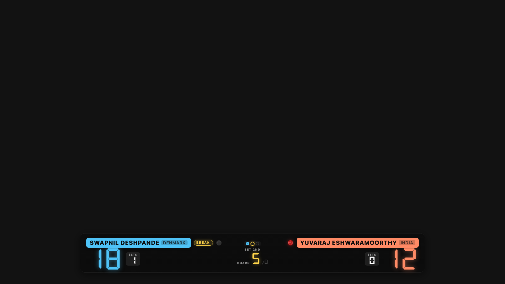
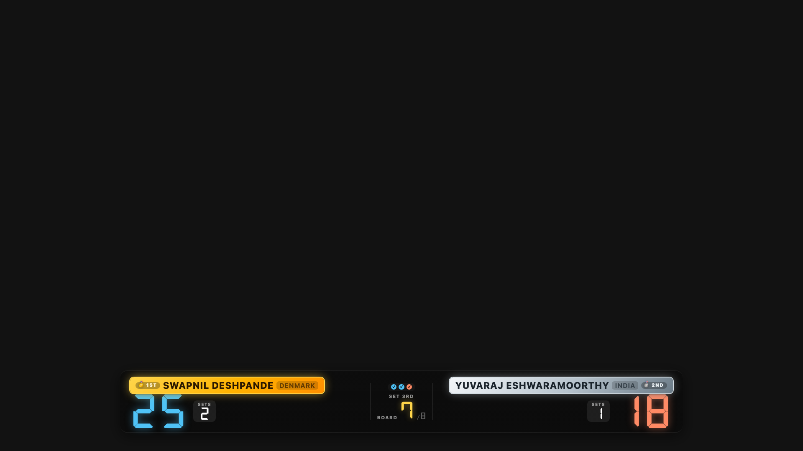

# Broadcast overlay (OBS / Prism)

Carromscore ships with a broadcast overlay: a transparent bottom-third
scoreboard strip that streaming software (OBS, Prism, Streamlabs, etc.)
can layer on top of a live camera feed.

  

Same visual language as the phone scoreboard — coloured player pills,
7-segment digits, set pips, BREAK / queen indicators. A broadcast
viewer sees the same thing your score-keeper sees.

## Live sync now works cross-device

Unlike v1.x, the overlay is now driven by Firebase — the umpire scores
on their phone and any device pointing at the overlay URL updates
within ~1 s. No need to co-locate the score-keeper laptop and OBS.

Toggle **Live** on match setup to enable publishing. The URL you paste
into OBS is the same regardless of which device runs the umpire.

## What it shows

- **Fully transparent background** — composites cleanly over camera
  footage.
- **Live-updates from Firebase** — every tap on the umpire's device
  propagates within ~1 s.
- **Match state**: current set, board number, points, sets-won count,
  BREAK chip, queen coin.
- **Tournament tag** (when set) appears next to the mode label at the
  top so the audience knows which event they're watching.
- **Winner medal treatment** — when the match ends and you tap 🏁 End,
  the overlay pills switch to gold/silver automatically.

## Setting up in Prism Live Studio

Prism has a Browser Source scene item — identical setup to OBS.

1. In the Carromscore app, tap **⧉ Share** in the footer.
2. Tap **Copy** on the **OBS overlay URL** row. (The other row is the
   spectator URL — a full read-only scoreboard for friends/family.)
3. In Prism, add a new source: **Browser Source** (called "Browser" or
   "Web" depending on your version).
4. Configure:
   - **URL**: paste the overlay URL.
   - **Width**: `1920`
   - **Height**: `1080`
   - **Custom CSS**: leave empty (the overlay ships its own transparent
     background).
   - **Shutdown source when not visible**: uncheck.
   - **Refresh browser when scene becomes active**: uncheck.
5. Click OK. The overlay appears in the scene preview, positioned at
   the bottom third of the frame with a transparent top.

Layer the sources so the camera feed is *below* the Browser Source:

- Camera (webcam / capture card): lower in the sources list.
- Browser Source (the overlay): above the camera.

Prism composites top-of-list on top, so this puts the score strip over
the video.

## Setting up in OBS Studio

Same steps — the source type is called **Browser** (or "Browser Source"
in some versions). Everything else is identical.

## The practice overlay

Practice mode has its own overlay layout that mirrors the versus-match
visual language: one wide pill with the SOLO badge + player name +
country tag, followed by one row per set showing every board tile plus
a per-set TOTAL. Board tiles use the same dark DSEG7 look as
singles/doubles POINTS. No active-tile highlight — the numbers do the
talking.

  

## Sizing the overlay

The overlay is designed for a **1920×1080** stream canvas. It occupies
the bottom third of the frame. For a 720p canvas, use 1280×720 for the
Browser Source dimensions and it scales down proportionally.

If you want the overlay in a corner or across a wider band, use OBS or
Prism's built-in transform:

- Right-click the Browser Source → **Transform** → **Edit Transform**
- Adjust the crop / scale / position numerically or by dragging
  handles.

The transparent background keeps compositing clean whatever you do.

## When the match ends

  

Tap 🏁 End on the phone. The overlay pills pick up the gold and silver
medal treatment automatically — 🥇 1ST on the winner, 🥈 2ND on the
loser. BREAK chip and queen coin disappear (match is over, they're no
longer meaningful).

Perfect way to end a live broadcast on a clean, celebratory frame.

## Troubleshooting

**"Overlay isn't updating when I tap the phone"** — check that **Live**
was toggled on at setup. The mid (match ID) in the overlay URL only
maps to a broadcast if the umpire's device is publishing. Also confirm
the phone has network connectivity; the overlay reads from Firebase
via the same URL.

**"There's a URL bar showing at the top of the overlay"** — you pasted
the spectator URL instead of the overlay URL. Get the overlay URL from
the **⧉ Share** popup on the phone (the row labelled OBS).

**"The overlay shows old scores after a while"** — right-click the
Browser Source → Properties → Refresh. Shouldn't be needed in normal
operation; the Firebase subscription auto-reconnects on network blips.

**"Player names are cut off"** — happens if the pill width is too
narrow for very long names. The pill truncates with an ellipsis. Try
a shorter display name in the Setup screen (e.g., "S. Deshpande"
instead of the full name).

## Related

- [Share URL](./share-url.md) — how the Share popup works.
- [Keeping the score](./keeping-the-score.md).
- [Break and queen](./break-and-queen.md).
- [Practice mode](./practice-mode.md) — practice-specific overlay layout.
