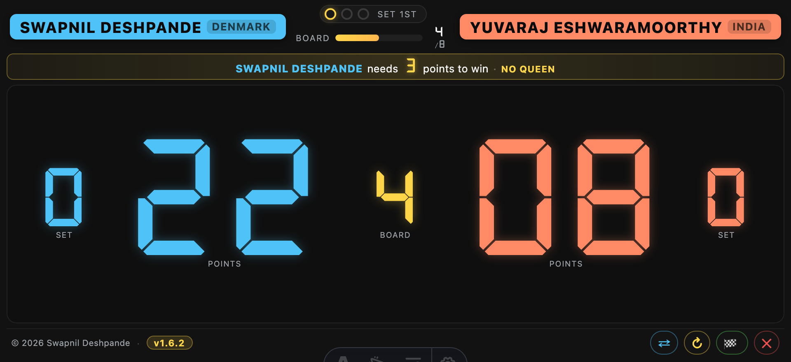
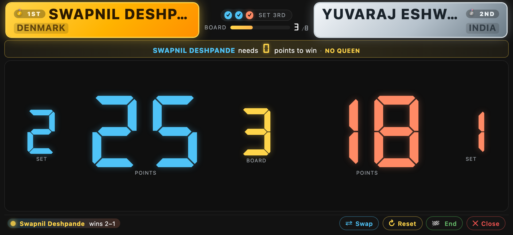

# Keeping the score

The score screen is the heart of Carromscore. It stays on your phone
during the whole match, big and bright enough to be readable from
across the room. Here's everything you can do on it.

  

## The layout

Left to right: **SET · POINTS · BOARD · POINTS · SET**.

- **POINTS** — big 7-segment (DSEG7) digits, one column per player.
  Cumulative points for the current set.
- **BOARD** — the middle column shows the count of *completed* boards
  in the current set. It starts at **0** (matches paper scorecards:
  the first row you write is Board 1 *after* it's finished).
- **SET** — the outer columns count how many sets each player has won.
- **Player pills** — the two coloured name pills at the top: cyan for
  side A, coral for side B. Country / region tag sits under the name.

## Updating the score

Every digit is a control. Two gestures to remember:

- **Tap a digit** → +1
- **Swipe left on a digit** → +1
- **Swipe right on a digit** → −1 (undo a mistake)

One gesture = one adjust. Deliberately small so an accidental touch
never resets a whole board.

Nothing auto-completes. Points don't jump to the next set when you hit
25 — you decide when the set ends by tapping the **SET** column. The
board number goes up when *you* tap **BOARD +1**. The app displays; the
human decides.

  

## Marking the queen

Each player's pill has a small **coin** icon above it. Tap the coin
next to whichever player pocketed the queen — it turns red to indicate
they hold it. Tap again to return the queen to the table (uncovered).

When the umpire ends a board with BOARD +1, the per-board snapshot
records who held the queen. That entry appears in the End-match recap
as a small **+Q** suffix next to that side's Coins column — so a board
where side A scored 4 coins plus the queen reads as `4 +Q` (score = 7).

See [Break and queen](./break-and-queen.md) for the full state machine
and how the coin behaves across boards and sets.

## Advancing boards — the queen guard

Tap **BOARD +1** to finish the current board. Two rules the app enforces:

1. **Queen must be resolved.** BOARD +1 is blocked until you either
   mark a queen holder or explicitly confirm "no queen this board."
   A small toast reminds you if you tap BOARD +1 too early. This
   guard prevents accidentally advancing past a half-scored board.
2. **Set already decided?** BOARD +1 is also blocked once a side has
   reached the points target — a toast points you at **SET +1** or
   **End**. Prevents phantom extra rows in the recap when the umpire
   tap-happy'ed one too many times.

  

## The footer buttons

Five buttons across the bottom, always visible in landscape:

| Button | What it does |
|---|---|
| **⧉ Share** | Opens a popup with the spectator URL and OBS overlay URL for OBS/Prism. See [Share URL](./share-url.md). |
| **⇄ Swap** | Physical swap-sides between sets. Names, notes, colours, sets, and current points travel with the players. Board stays put. Queen resets to grey. |
| **↻ Reset** | Zero everything: sets, points, board, queen. Asks for confirmation. |
| **🏁 End** | Ends the match. Recap dialog opens with the paper-scorecard matrix; medals lock onto pills. |
| **✕ Close** | Quit the match and return to the setup screen. Asks for confirmation. |

## Ending a match

Tap **🏁 End**. A recap dialog opens showing the full board-by-board
matrix with per-board Points, Coins, and the +Q queen suffix on
whichever side pocketed it. Cumulative Score column tracks the running
total across boards.

  

Dismiss the popup and the pills switch to a **gold** and **silver**
medal treatment — 🥇 1ST on the winner, 🥈 2ND on the loser.

  

## Post-End: the lockout

Once **End** has fired, all positive scoring inputs freeze — tapping
POINTS/BOARD/SET or the queen coin surfaces a small toast:
*"Match ended — score is locked. Use Reset to start over."* Negative
deltas (POINTS −1, BOARD −1, SET −1) remain enabled so an accidental
End can be undone without a full Reset.

Rationale: after the match is over, the record is canonical — a stray
tap on the phone shouldn't rewrite the archive. If you genuinely want
to keep playing, **Reset** clears everything and re-arms all inputs.

## What happens if I refresh?

Nothing bad. The full match state is saved on your phone as you play,
so an accidental refresh, a phone call, or the app being backgrounded
all restore exactly where you were. The screen stays awake through the
match too, so you don't have to keep tapping it.

## The recap and admin edits

The recap you see on End is the same view the /live/ lobby shows when
you tap a match card in the History tab. If a super-admin or the
tournament organiser is signed in, that same recap gains a ✎ pencil
that opens an edit modal — useful when you spot a scoring error after
the fact. See [`docs/admin.md`](../admin.md).

## Related

- [Break and queen indicators](./break-and-queen.md)
- [Practice mode](./practice-mode.md) — solo drill with no opponent.
- [Broadcast overlay](./broadcast-overlay.md) — for streaming with OBS/Prism.
- [Share URL](./share-url.md) — spectator + OBS overlay URLs.
- [Contact](../contact.md) — email, GitHub Discussions, feedback.
