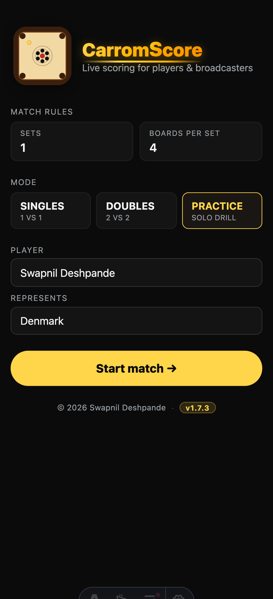
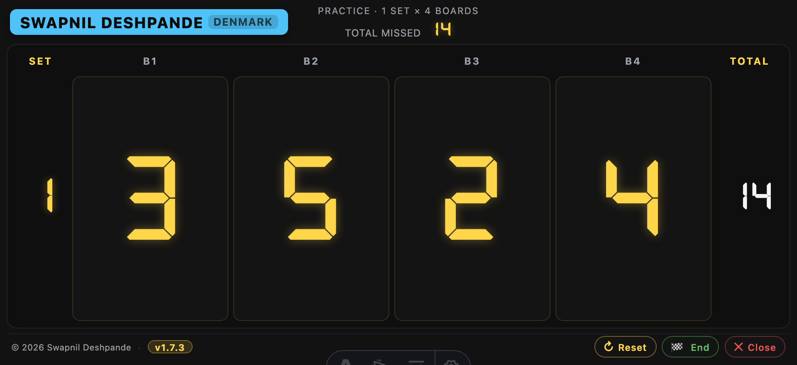
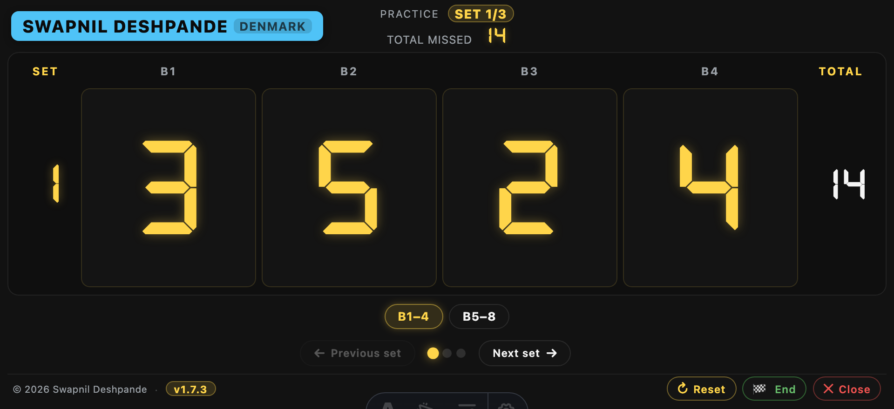
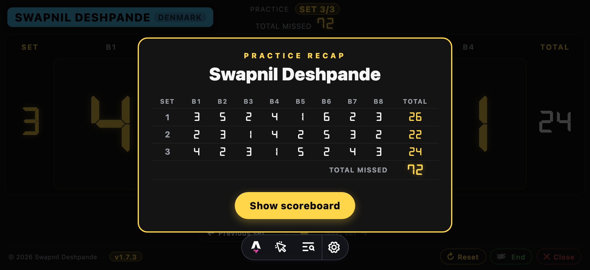

# Practice mode (solo drill)

Practice mode is for playing carrom alone at home. Instead of tracking
points against an opponent, you record how many **shots you missed** on
each board. Lower total = better session. There's no winner.

Great for personal training, or for a group where everyone plays the
same drill and the lowest total wins.

## Setting up

Open the app and tap the **Practice** mode chip (next to Singles and
Doubles). The form collapses to just the fields you need: number of
sets, boards per set, one player name, and one "Represents" field.

  

Defaults are **1 set × 4 boards**. Change them to match your usual drill.

## Scoring a session

Tap **Start match** and the scoreboard opens. Instead of the usual
SET / POINTS / BOARD layout, you get a row of digit cells labelled
**B1, B2, B3, …** with **SET** on the left and **TOTAL** on the right.

  

**Each cell tracks misses on one board.** Tap it once for each shot
you missed. Same gesture set as normal scoring — tap for +1, swipe
left for +1, swipe right for −1. TOTAL is calculated for you.

## Sessions with lots of boards

For more than 4 boards, the row scrolls horizontally in pages of 4.
Small chips underneath (**B1–4** / **B5–8** etc.) let you jump between
pages. SET / TOTAL columns stay pinned on either side so the totals
are always in view.

  

## Sessions with lots of sets

Multi-set drills page one set at a time. Prev / next arrows advance
through them, and a small pip strip in the header tells you which set
you're on. The running **Total missed** at the top of the screen
accumulates across all sets so you always see the grand total.

## Ending a session

Tap **🏁 End Match** — the recap popup shows the whole board-by-board
matrix with per-set totals and the grand total missed:

  

No fireworks, no medals — Practice never declares a winner. Take a
screenshot if you want to share with a group.

## Related

- [Keeping the score](./keeping-the-score.md) — normal Singles/Doubles scoring.
- [Install on Android](./install-android.md) or [Install on iPhone](./install-iphone.md).
