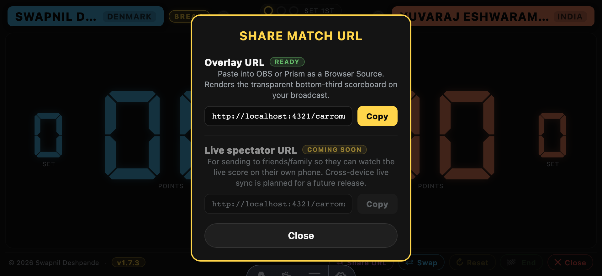

# Share URL

The **⧉ Share** button in the score-screen footer opens a small popup
with two URLs you can hand off — one for spectators to watch on their
own device, one for streaming software.

  

## Spectator URL

Paste this into a WhatsApp / iMessage / email to friends and family so
they can watch the live score on their own phone. Opens as the full
read-only scoreboard — coloured pills, DSEG7 digits, set pips, BREAK
and queen indicators, board-by-board recap below.

Updates within ~1 s of every tap on the umpire's device (as long as
**Live** was toggled on at setup). Works from anywhere with a browser.

Tap **Copy** on the row — the URL lands on your clipboard, the button
flashes ✓ Copied, and you're done.

## OBS overlay URL

Paste this into **OBS**, **Prism Live Studio**, or any streaming
software's Browser Source. It renders the transparent bottom-third
scoreboard strip designed to composite over a camera feed of your
carrom board.

Full walkthrough in [Broadcast overlay](./broadcast-overlay.md).

## Requires Live broadcast

Both URLs work only when **Live** is toggled on at match setup. Without
Live, no data publishes to Firebase and the URL renders an empty
scoreboard.

Practice mode supports Live the same way — the spectator URL shows the
per-set miss matrix, and the OBS overlay renders the compact
practice-specific tile row.

## What's in the URL

Both URLs carry a short 6-character `mid` (match ID) that keys into the
Firebase Realtime Database record for this match. The difference:

- **Spectator URL**: `.../live/?mid=xxx` — renders the full scoreboard.
- **OBS overlay URL**: `.../live/?mid=xxx&view=overlay` — renders as a
  transparent broadcast strip.

Nothing sensitive is in the URL. There are no tokens, no accounts, no
credentials. The `mid` is randomly generated at match start and only
identifies which live-record to subscribe to — anyone with the URL sees
the same data. Sharing the URL is exactly like sharing a link to a
public webpage.

## Also on the /live/ lobby

Every match with Live enabled also shows up in the /live/ lobby's
"Now Playing" tab automatically. If you'd rather send someone the lobby
URL and let them find your match by name, that works too. Once the
match ends, it moves to the "History" tab (grouped by tournament tag)
where it's viewable forever.

## Related

- [Broadcast overlay](./broadcast-overlay.md) — how to use the overlay URL in OBS/Prism.
- [Keeping the score](./keeping-the-score.md).
